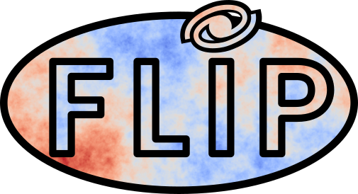

# flip: Field Level Inference Package

flip is a Python package that uses the maximum likelihood method to fit the growth rate based on the velocity and density fields. The first part of the software is the computation of a covariance matrix from a model power spectrum and the considered coordinates. This part is generalized to work for any linear power spectrum models, both for velocities, densities, and cross-terms, and it is optimized with Hankel transform for any model. In the second part, the covariance is used to create a likelihood by multiplying it by velocities or densities. Finally, this package includes some integrated fitters such as Minuit and MCMC (with emcee) to fit the growth rate of structures.


[](https://flip.readthedocs.io/en/latest/?badge=latest)

## Quick install
```bash
git clone https://github.com/corentinravoux/flip.git
cd flip
pip install .
```
For now, the package requires you to install manually cosmoprimo: pip install git+https://github.com/cosmodesi/cosmoprimo


## Required packages

Mandatory: numpy, scipy, matplotlib, [cosmoprimo](https://github.com/adematti/cosmoprimo), iminuit, emcee, sympy

Optional: classy, pyccl, pypower, GPy, tensorflow 

## Examples

For an example with velocity fit check out: <a target="_blank" href="https://colab.research.google.com/github/corentinravoux/flip/blob/main/notebook/fit_velocity.ipynb">
  
</a>

For density only: <a target="_blank" href="https://colab.research.google.com/github/corentinravoux/flip/blob/main/notebook/fit_density.ipynb">
  
</a>

For a joint fit: <a target="_blank" href="https://colab.research.google.com/github/corentinravoux/flip/blob/main/notebook/fit_joint.ipynb">
  
</a>

## Need help?
Documentation available on [ReadTheDoc](https://flip.readthedocs.io/) 

## How to cite

The full description of the core concepts of this package is given [here](https://arxiv.org/abs/2501.16852).
This package was started on the previous work of [@bastiencarreres](https://github.com/bastiencarreres), detail in [this article](https://arxiv.org/abs/2303.01198).
Please cite both paper when using the package.
