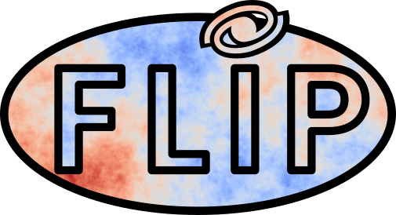
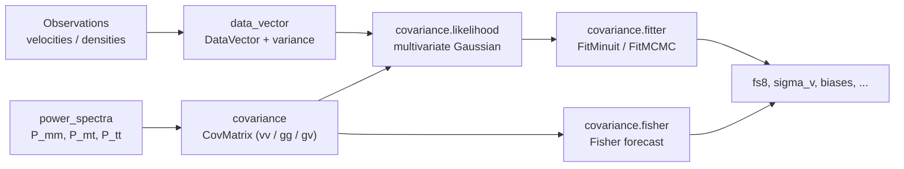

# flip



**flip** (Field Level Inference Package) fits the **growth rate of structure**
from the **peculiar-velocity** and **density** fields with a maximum-likelihood,
field-level method (Ravoux et al. 2025,
[arXiv:2501.16852](https://arxiv.org/abs/2501.16852); building on Carreres et al.
2023, [arXiv:2303.01198](https://arxiv.org/abs/2303.01198)).

It is organised as a three-stage pipeline:

1. **Data representation** — wrap velocity and/or density measurements in a
   [`DataVector`](data-vectors.md), which knows how to turn raw observables
   (direct velocities, Hubble-diagram residuals, SN Ia SALT2 fits, Tully-Fisher,
   Fundamental Plane, log-distance ratios, gridded fields, ...) into a data
   vector and its variance.
2. **Covariance computation** — build the model
   [covariance matrix](covariance-models.md) from a linear
   [power spectrum](power-spectra.md) and the object coordinates. This step is
   generalised to any linear power-spectrum model — for velocities, densities and
   their cross-term — and is optimised with a Hankel (FFTLog) transform.
3. **Statistical inference** — multiply the covariance by the data to form a
   [likelihood](likelihoods.md) and [fit](fitting.md) the growth rate with
   integrated Minuit / MCMC fitters, or forecast it with a Fisher matrix.

## The pipeline at a glance



## Quick install

```bash
git clone https://github.com/corentinravoux/flip.git
cd flip
pip install .
```

See [Installation](installation.md) for optional cosmology engines and
acceleration backends.

## Quick look

```python
from flip import data_vector
from flip.covariance import covariance, fitter
from flip.data import load_data_test

# 1. Data: a direct peculiar-velocity sample (packaged example data)
coordinates_velocity, velocity = load_data_test.load_velocity_data()
data = data_vector.DirectVel(velocity)

# 2. Covariance: pick a model and a power-spectrum dictionary
power_spectrum_dict = load_data_test.load_power_spectrum_dict(sigmau_fiducial=15.0)
covariance_fit = covariance.CovMatrix.init_from_flip(
    "carreres23",
    "velocity",
    power_spectrum_dict,
    coordinates_velocity=coordinates_velocity,
)

# 3. Likelihood + Minuit fit for the growth rate fs8 and the dispersion sigv
parameter_dict = {
    "fs8": {"value": 0.4, "limit_low": 0.0, "fixed": False},
    "sigv": {"value": 200.0, "limit_low": 0.0, "fixed": False},
}
minuit_fitter = fitter.FitMinuit.init_from_covariance(
    covariance_fit,
    data,
    parameter_dict,
    likelihood_properties={"inversion_method": "cholesky_inverse"},
)
minuit_fitter.run()
```

Runnable notebooks (velocity / density / joint fits) are linked from
[Getting started](getting-started.md).

## Where flip sits

flip is the **Pillar 2** (estimators + likelihoods) anchor of a broader
cosmology stack: it consumes standardised measurements and returns a posterior on
the growth rate `f σ₈` (and related parameters). The fiducial cosmology enters
only at the estimator call site — through the power-spectrum engine and the
velocity estimator — never in the data storage layer.

## How to cite

If you use flip, please cite the two papers that describe it:

- Ravoux et al. 2025 — [arXiv:2501.16852](https://arxiv.org/abs/2501.16852)
- Carreres et al. 2023 — [arXiv:2303.01198](https://arxiv.org/abs/2303.01198)

and the software itself via the metadata in
[`CITATION.cff`](https://github.com/corentinravoux/flip/blob/main/CITATION.cff).
